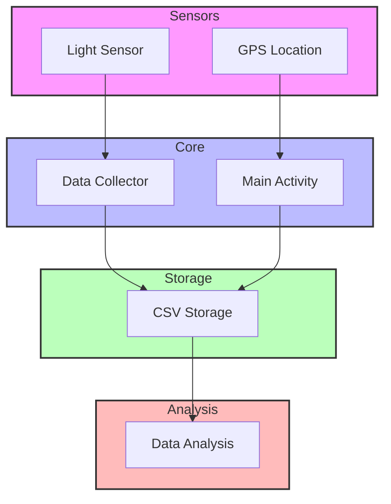
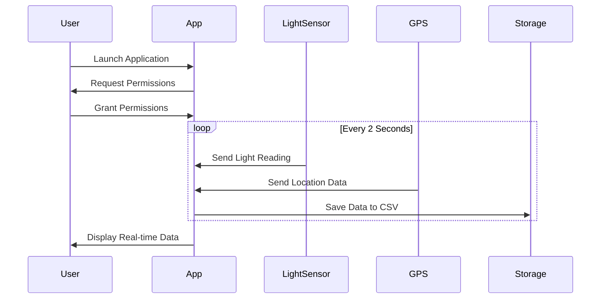

# Sun or Shade

## Overview
Location-Light is an Android application designed to collect and analyze light sensor data in conjunction with geographical location information. The project aims to gather environmental data that can be used for data mining and machine learning techniques to determine areas of shade over specific geographic locations.

## Features
- Real-time light sensor data collection
- GPS location tracking
- Automatic data logging to CSV format
- Data collection at regular intervals (2-second intervals)
- Simple and intuitive user interface
- Background data collection capability

## Technical Architecture

### Components
1. **Sensor Management**
   - Light sensor integration
   - GPS location services
   - Sensor event handling

2. **Data Collection**
   - Automatic data sampling
   - CSV file storage
   - Timestamp recording

3. **User Interface**
   - Real-time sensor value display
   - Location coordinates display
   - Clean, minimal design

### Data Structure
The application collects the following data points:
- Date
- Time
- Latitude
- Longitude
- Light intensity (in lux)

## Technical Requirements
- Android SDK 21 or higher
- Google Play Services
- Location permissions
- Storage permissions

## Dependencies
- OpenCSV (4.0) - For CSV file handling
- Google Play Services Location (15.0.1) - For location services
- EasyDeviceInfo (2.4.1) - For device information
- AndroidX AppCompat (1.1.0) - For UI components

## Setup and Installation
1. Clone the repository
2. Open the project in Android Studio
3. Sync Gradle dependencies
4. Build and run the application

## Usage
1. Launch the application
2. Grant necessary permissions (location and storage)
3. The app will automatically start collecting data
4. Data is saved to `dataForProject.csv` in the device's external storage

## Data Collection Process
1. The app collects data every 2 seconds
2. Each data point includes:
   - Current date and time
   - GPS coordinates
   - Light sensor reading
3. Data is automatically appended to the CSV file

## Future Improvements
1. **Data Analysis**
   - Integration with data visualization tools
   - Machine learning model implementation
   - Shade prediction algorithms

2. **User Interface**
   - Interactive maps
   - Data visualization graphs
   - Custom data collection intervals

3. **Features**
   - Cloud synchronization
   - Multiple data collection profiles
   - Export functionality
   - Real-time shade analysis

## Architecture Diagrams

### System Architecture

### Data Flow Sequence

## Contributing
Contributions are welcome! Please feel free to submit a Pull Request.

## License
This project is licensed under the MIT License - see the LICENSE file for details.

## Acknowledgments
- Google Play Services for location functionality
- OpenCSV for data storage
- Android community for development resources 
